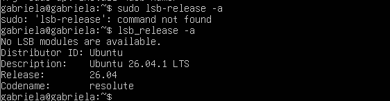
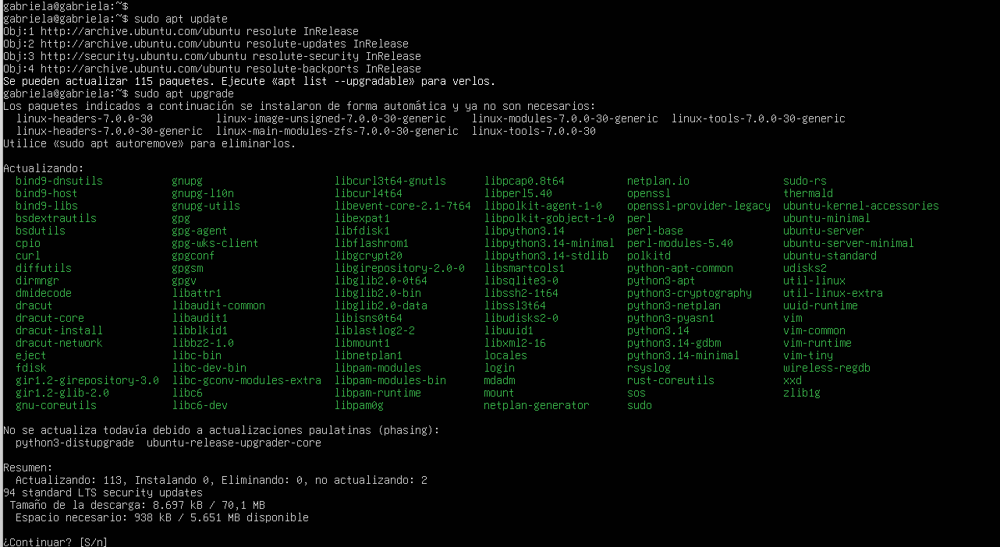

# PR0102
Despliegue de Aplicaciones Web  Curso 2026/2027
## Introducción

En esta práctica se realiza la instalación y configuración de Webmin sobre un sistema Ubuntu Server instalado en una máquina virtual mediante Oracle VirtualBox.
El objetivo es instalar y configurar Webmin, comprobar su funcionamiento y documentar el proceso mediante Markdown, capturas de pantalla y scripts.

## 1. Instalación de Ubuntu

PASO INICIAL:
CREAR UNA MAQUINA VIRTUAL VM: para esto, descargo Virtual Box Oracle de esta pagina https://www.oracle.com/es/virtualization/technologies/vm/downloads/virtualbox-downloads.html?source=:ow:o:p:nav:mmddyyVirtualBoxHero_es&intcmp=:ow:o:p:nav:mmddyyVirtualBoxHero_es y el ISO de la VM Ubuntu Server 
Especificaciones importantes: Placa Base: 3072 MB – 2 discos duros / Red: Adaptador 1 NAT. Adaptador 2 Red solo anfitrión
IMPORTANTE: durante la instalación no olvidar activar (x) SSH para que la VM tenga el servicio SSH 

## 2. Entorno de trabajo

* Sistema operativo: Ubuntu Server
* Virtualización: Oracle VirtualBox
* Herramienta de administración: Webmin
* Repositorio usado: GitHub en modo público

## 3. Instalación y configuración de Ubuntu


### 3.1. Comprobación del sistema

*Para comprobar la instalacion del UBUNTU se hizo el comando lsb-release - a. Lo cual dio como resultado que el sistema utilizado en esta práctica es Ubuntu 26.04.1 LTS, versión 26.04, con nombre en clave resolute.

### 3.2. Actualización de los repositorios

Para que todos los paquetes esten disponibles se hizo un sudo apt update y para que estén actualizados se hizo un sudo apt upgrade 


### 3.3. Actualización del sistema

## 4. Configuración de SSH

### 4.1. Instalación de SSH

### 4.2. Comprobación del servicio SSH

## 5. Instalación de Webmin

### 5.1. Preparación del sistema

### 5.2. Instalación de Webmin

### 5.3. Comprobación de la instalación

## 6. Configuración del firewall

### 6.1. Configuración de los puertos necesarios

### 6.2. Comprobación del firewall

## 7. Acceso a Webmin

### 7.1. Acceso mediante navegador

### 7.2. Comprobación del funcionamiento

## 8. Automatización mediante script

### 8.1. Creación del script

### 8.2. Funcionamiento del script

### 8.3. Ejecución y comprobación

## 9. Estructura del repositorio

```text
Practica-0102/
├── README.md
├── images/
└── scripts/
```

## 10. Conclusiones

En esta práctica se ha realizado la instalación y configuración de Webmin sobre Ubuntu Server y se ha documentado el procedimiento para facilitar su reproducción posterior.

### Comprobación de la versión
